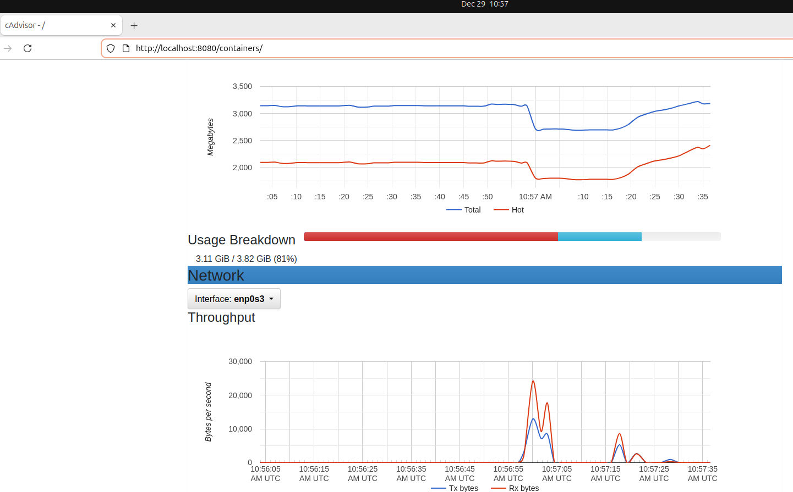
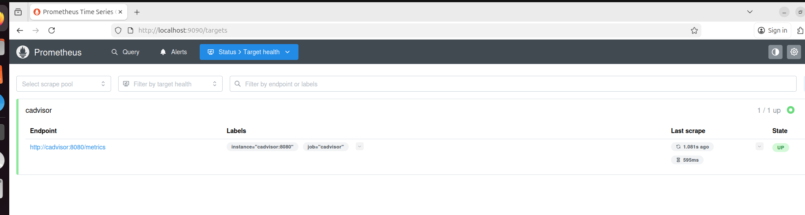
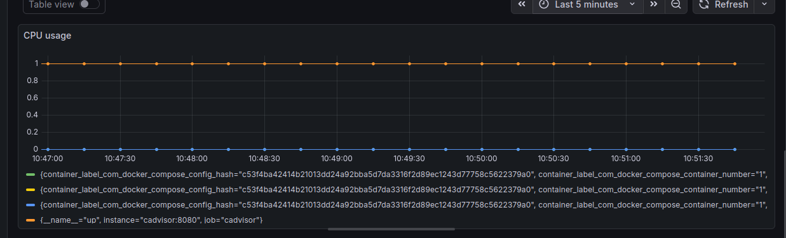
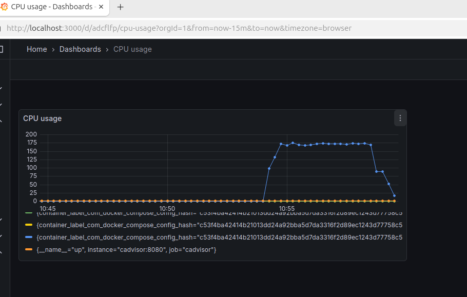

Отчет по проекту: Мониторинг Docker-контейнеров
1. Цель работы
Развертывание системы мониторинга для отслеживания ресурсов Docker-контейнеров в реальном времени с использованием стека Prometheus, cAdvisor и Grafana.

2. Используемые компоненты
webapp (nginx) — тестовое приложение для мониторинга.

cAdvisor — агент для сбора метрик (CPU, RAM, Network) напрямую из контейнеров.

Prometheus — база данных временных рядов для хранения собранных метрик.

Grafana — платформа для визуализации данных и создания дашбордов.

3. Запуск системы
Для запуска использовался файл docker-compose.yml, объединяющий все сервисы в одну сеть.

Статус запущенных контейнеров:

4. Проверка сбора данных
4.1. Работа cAdvisor
cAdvisor успешно обнаружил запущенные контейнеры и начал экспорт метрик.

4.2. Статус источников в Prometheus
В веб-интерфейсе Prometheus (Status -> Targets) подтверждено соединение с cAdvisor.

5. Визуализация в Grafana
В Grafana был подключен источник данных Prometheus и создан дашборд для отслеживания ресурсов контейнера webapp.

5.1. Мониторинг в состоянии покоя
Показатели потребления ресурсов приложением nginx при отсутствии внешних запросов.

5.2. Мониторинг под нагрузкой
Для генерации нагрузки был запущен цикл запросов curl. На графиках зафиксирован рост потребления CPU и сетевого трафика.

6. Выводы
Система успешно фиксирует изменения в потреблении ресурсов контейнерами в реальном времени.

Использование cAdvisor позволяет получать детальную статистику без внесения изменений в код самого приложения.

Связка Prometheus и Grafana обеспечивает гибкую настройку визуализации и позволяет оперативно выявлять аномалии под нагрузкой.
